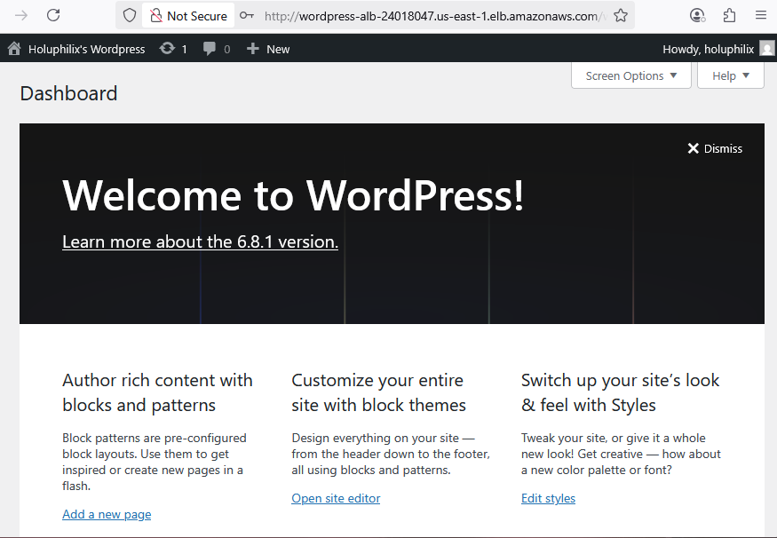

# Capstone Project: Automated WordPress Deployment on AWS with Terraform
## Project Scenario and Overview
The **Capstone Project: Automated WordPress Deployment on AWS with Terraform** focuses on building a scalable, secure, and high-performance WordPress website for **DigitalBoost**, a growing digital marketing agency. The organization required a cost-effective cloud solution capable of handling increasing traffic while ensuring seamless integration with their existing operations.

This project leverages Terraform to automate the provisioning of AWS infrastructure, enabling consistent, repeatable, and efficient deployments through Infrastructure as Code (IaC).

It provided a hands-on opportunity to apply and strengthen my DevOps expertise by orchestrating AWS services such as EC2, RDS, EFS, Load Balancer, Auto Scaling, and VPC, all managed through modular Terraform configurations. The work highlights my ability to design and implement robust, production-grade cloud architectures tailored to real-world business needs.
### Why Am I Doing This?
This project serves the following purposes:

1. **Practical Experience:**  To gain hands-on experience in designing and deploying secure, scalable cloud environments.
2. **Problem-Solving Skills:** To apply key DevOps concepts such as networking, databases, and load balancing in a real-world scenario.
3. **Cloud Expertise:** To deepen my knowledge of AWS services and implement best practices in cloud architecture and deployment.
4. **Infrastructure as Code (IaC) Mastery:**  To showcase my ability to automate infrastructure using Terraform, ensuring repeatability, scalability, and version control throughout the deployment process.

By successfully completing this project, I aim to demonstrate my ability to design and manage robust cloud-based solutions—solidifying my path toward becoming a skilled and job-ready DevOps engineer.
### Tasks Completed
To achieve the project goals, I completed the following tasks:
1. **VPC Setup**

   * Configured a Virtual Private Cloud (VPC) to securely isolate project resources within a custom network environment.

2. **Public and Private Subnet Configuration with NAT Gateway**

   * Designed and implemented a network architecture with both public and private subnets for enhanced security and scalability.
   * Set up a NAT Gateway to enable secure internet access for instances in private subnets.

3. **Amazon RDS for MySQL**

   * Provisioned a managed MySQL database using Amazon RDS to ensure high availability, durability, and simplified maintenance.

4. **Amazon EFS for WordPress**

   * Configured Amazon Elastic File System (EFS) to provide scalable, shared file storage across WordPress instances.

5. **Application Load Balancer (ALB) Setup**

   * Deployed an Application Load Balancer to evenly distribute incoming traffic across EC2 instances, enhancing performance and fault tolerance.

6. **Auto Scaling Group (ASG) Configuration**

   * Implemented an Auto Scaling Group to automatically adjust the number of EC2 instances based on demand, ensuring high availability and cost efficiency.
### Resources Used
#### AWS Services
* **Amazon EC2** – Hosts the WordPress application across scalable instances.
* **Amazon RDS (MySQL)** – Provides a managed, highly available MySQL database backend for WordPress.
* **Amazon EFS** – Delivers shared, scalable file storage for WordPress media and plugin files.
* **Amazon VPC** – Ensures network isolation and security by organizing resources within a virtual private network.
* **Application Load Balancer (ALB)** – Distributes incoming traffic across EC2 instances, improving performance and availability.
* **Auto Scaling Group (ASG)** – Automatically scales EC2 instances based on traffic demand to ensure high availability and cost efficiency.
* **NAT Gateway** – Allows instances in private subnets to securely access the internet for updates and dependencies.
#### WordPress Platform
* **Content Management System (CMS)** – WordPress was used as the primary content platform, enabling easy website creation, management, and customization.
### Scripts and Tools
#### Automation Scripts
* **Terraform Modules and Configurations** – Used to provision and manage AWS infrastructure components including VPC, Subnets, EC2, RDS, EFS, Load Balancer, and Auto Scaling Group.
* **EC2 User Data Scripts** – Embedded within Terraform EC2 configurations to automate the installation and setup of the WordPress application during instance launch.
#### Tools
* **Visual Studio Code (VS Code)** – Used for writing, editing, and managing Terraform configuration files efficiently.
* **Terraform CLI** – For initializing, planning, applying, validating, and managing infrastructure as code.
* **AWS Management Console** – Used for additional monitoring, validation, and manual inspection of AWS resources.
* **AWS Command Line Interface (CLI)** – Enables programmatic interaction with AWS services and resource verification.
* **Git** – Used for version control of Terraform files, project documentation, and collaboration.
* **Git Bash** – Provides a Unix-like terminal on Windows for executing Git commands and shell scripts effectively.

These tools and scripts streamlined the development, deployment, and infrastructure management processes ensuring automation, reproducibility, and alignment with DevOps best practices.
### Conclusion
This project demonstrates the power and flexibility of **Infrastructure as Code (IaC)** using **Terraform** to provision and manage a complete WordPress environment on **AWS**. By applying best practices such as modular design, high availability, auto-scaling, and secure networking (including Bastion host access and VPC isolation), the deployment achieves production-grade quality. The resulting architecture is scalable, reliable, and capable of supporting real-world traffic and operational demands with confidence.
### Project Deliverables
#### Documentation:
- **Detailed Infrastructure Documentation**:  Step-by-step guides for provisioning each AWS component using Terraform, including the configuration files, module structure, and deployment instructions.
- **Terraform Configuration Explanation:** Clear descriptions of the Terraform modules, variables, outputs, and state management strategies used in the project.
- **Security Measures**: Comprehensive overview of security configurations such as IAM roles and policies, security groups, encryption settings, and safe handling of sensitive data in Terraform.
- **Operational Procedures:** Instructions for managing infrastructure lifecycle including applying updates, destroying resources, and troubleshooting common issues.
- **Best Practices and Testing:** Documentation on code validation, formatting standards, and testing procedures applied to maintain code quality and infrastructure reliability.
#### Demonstration:
- **Live WordPress Site Demo:** A fully functional WordPress site deployed on AWS, demonstrating the integration of all services.
- **Auto-Scaling and Load Balancing Showcase:** A simulation of traffic spikes to highlight automatic scaling capabilities and load distribution ensuring high availability and performance.
### Project Overview
**Screenshot:** 

### Task 1: Foundational Setup: Git, Directory Structure, and Core Files:
In this step, the project’s foundational structure was created and initialized for version control, establishing a clean and organized environment for Terraform development.
**Key Takeaways:**
- A well-structured directory was created, with subdirectories for modular Terraform configurations (e.g., vpc, ec2, rds, alb, etc.).
- Git was initialized in the root directory to enable version control and track the project's evolution.
- Core Terraform files were created in the root configuration:
  - `main.tf`– Contains the primary configuration for invoking modules.
  -  `variables.tf` – Declares input variables for dynamic configuration.
  -  `outputs.tf`– Defines outputs to expose values from the infrastructure.
- A .gitignore file was added to exclude Terraform state files (*.tfstate), backup files, and sensitive data from being tracked in version control.
- A **Security Group** module was added as one of the initial infrastructure components to manage inbound/outbound traffic rules for other resources.
#### Step 1: Initialize Git and Create Project Directory
**Objective:**  
 Set up the base project structure and initialize version control using Git.
1. **Initialize Git Repository**  
   To start, create the project directory, navigate into it, and initialize the Git repository for version control.
   
   **Note:** For this project, I am using **Git Bash** on a Windows workstation to execute these shell commands, as it provides a Unix-like command-line experience.

   **Commands:**
   ```bash
   mkdir wordpress-terraform-aws
   cd wordpress-terraform-aws
   git init
   ```
   This initializes a Git repository, enabling version control, commit tracking, and integration with remote repositories like GitHub.
 
2. **Add .gitignore File**  
   Create a `.gitignore` file to exclude unnecessary files and directories from version control. This is important to avoid checking in sensitive information like credentials or environment-specific files that don't need to be tracked.
   
   **Commands:**
   ```bash
   touch .gitignore
   ```

   Scripts content for `.gitignore`:
   ```bash
   # I<gnore Terraform plan and state files
   .terraform/
   terraform.tfstate
   terraform.tfstate.backup
   
   # Ignore IDE-specific files
   .vscode/
   *.log
   ```
#### Step 2: Create the Project Directory and Subdirectories
After initializing Git, the next step is to create the core directory structure for the Terraform project.
1. **Create Project Subdirectories**  
   Organize your Terraform configuration files into separate subdirectories for modularity, such as creating modules for VPC, EC2, RDS, Security Groups, etc. Each module will have its own `main.tf`, `variables.tf`, and `outputs.tf` files.
- **Create main modules directory and subdirectories**

**Command:**
```bash
mkdir -p modules/{vpc,eip,bastion,wordpress,nat_gateway,rds,efs,alb,asg,security_group}
```
- **Create main.tf, variables.tf, and outputs.tf in each subdirectory**

**Command:**
```bash
for dir in modules/*; do
  touch "$dir/main.tf" "$dir/variables.tf" "$dir/outputs.tf"
done
```
#### Step 3: Create Main Root Terraform Configuration Files 
   These files will define the provider, backend, and other necessary configurations for your infrastructure.
   **Purpose of Each File:**
   - `main.tf`: To define the provider and backend for Terraform state management.
   - `variables.tf`: To define all the input variables for flexibility.
   - `outputs.tf`: To capture the output of resources once Terraform applies the configuration.
   - `terraform.tfvars`: Provides actual values for the variables defined in `variables.tf`.
   - `user_data.sh.tpl`: Contains the user data script template (e.g., for installing software on an EC2 instance).
   - `README.md`: Documents the purpose, structure, and usage instructions of the project.
  
**Commands:**
```bash
touch main.tf
touch variables.tf
touch outputs.tf
touch terraform.tfvars
touch user_data.sh.tpl
touch README.md
```
#### Step 4: Create the `provider.tf` File
The `provider.tf` file will configure the AWS provider for Terraform.
1. **Create the `provider.tf` file:**
In your project root directory (`wordpress-terraform-aws`), create a file named `provider.tf` to define the AWS provider configuration.

**Command:**
```bash
touch provider.tf
```
2. **Add AWS Provider Configuration:**

In the `provider.tf` file, add the following configuration to specify AWS as the provider and define the region you are deploying your infrastructure to.

**provider.tf:**
```hcl
# provider.tf
provider "aws" {
  region = "us-east-1"  # Specify your preferred AWS region here (e.g., us-west-2, eu-central-1)
}
```
- The `region` parameter specifies the AWS region where your resources will be deployed. You can replace `"us-east-1"` with your preferred region.
  
3. **Add the `provider.tf` to your Terraform Workflow:**

Now, you have the `provider.tf` file that allows Terraform to interact with AWS. When running `terraform plan` or `terraform apply`, Terraform will use this provider configuration to communicate with AWS and manage resources.
#### Step 5: Initialize Terraform Configuration
With the files in place, initialize the Terraform project.

1. **Initialize Terraform:**
   Run the `terraform init` command to initialize the project. This will download the necessary provider plugins and prepare the environment for configuration.

   **Command:**
   ```bash
   terraform init
   ```

2. **Check for Syntax Errors:**
   Ensure that there are no syntax errors by running:

   **Command:**
   ```bash
   terraform validate
   ```
### Task 2: VPC and Networking Setup
#### 🎯 Objective  
Create a **Virtual Private Cloud (VPC)** along with its **subnets**, **routing**, and **security group**, to isolate and secure the WordPress infrastructure. This includes defining public and private subnets across multiple availability zones and configuring secure communication for resources.
#### 📌 Updated VPC Architecture
- **Region**: US East (N. Virginia) `us-east-1`
- **VPC CIDR**: `10.0.0.0/16`
- **Public Subnets**:
  - AZ1: `10.0.0.0/24`
  - AZ2: `10.0.1.0/24`
- **Private Subnets**:
  - AZ1: `10.0.2.0/24`
  - AZ2: `10.0.3.0/24`
- **Internet Gateway**: Enables internet access for public subnet resources
- **Route Tables**:
  - Public Route Table for public subnets
  - Main Route Table (used by default for private subnets)
- **Security Group**:
  - Allows SSH (port 22), HTTP (port 80), and HTTPS (port 443) access
  - Restricts inbound traffic to only what's necessary
  - Enables all outbound traffic
#### 🛠️ Step 1: Create VPC Module
##### ➕ `modules/vpc/main.tf`
```hcl
resource "aws_vpc" "this" {
  cidr_block           = var.vpc_cidr
  enable_dns_support   = true
  enable_dns_hostnames = true

  tags = {
    Name    = var.vpc_name
    Project = var.project
  }
}
```
##### ➕`modules/vpc/variables.tf`
```hcl
variable "vpc_name" {
  description = "Name of the VPC"
  type        = string
}

variable "project" {
  description = "Project tag for resources"
  type        = string
}

variable "vpc_cidr" {
  description = "CIDR block for the VPC"
  type        = string
}
```
##### 📤 `modules/vpc/outputs.tf`
```hcl
output "vpc_id" {
  description = "The ID of the VPC"
  value       = aws_vpc.this.id
}
```
#### 🔐 Step 2: Create Security Group Module
##### ➕ `modules/security_group/main.tf`
```hcl
resource "aws_security_group" "this" {
  name        = var.name
  description = var.description
  vpc_id      = var.vpc_id

  dynamic "ingress" {
    for_each = var.ingress_rules
    content {
      from_port   = ingress.value.from_port
      to_port     = ingress.value.to_port
      protocol    = ingress.value.protocol

      cidr_blocks              = contains(keys(ingress.value), "cidr_blocks") ? ingress.value.cidr_blocks : null
      security_groups          = contains(keys(ingress.value), "security_groups") ? ingress.value.security_groups : null
    }
  }

  egress {
    from_port   = 0
    to_port     = 0
    protocol    = "-1"
    cidr_blocks = ["0.0.0.0/0"]
  }

  tags = {
    Name = var.name
  }
}
```
#### ✍️ `modules/security_group/variables.tf`
```hcl
variable "name" {
  type        = string
  description = "Name of the security group"
}

variable "description" {
  type        = string
  description = "Description of the security group"
}

variable "vpc_id" {
  type        = string
  description = "The VPC ID to associate with the security group"
}

variable "ingress_rules" {
  type = list(object({
    from_port               = number
    to_port                 = number
    protocol                = string
    cidr_blocks             = optional(list(string))
    source_security_group_id = optional(string)
  }))
  description = "List of ingress rules for the security group"
}
```
#### 📤 `modules/security_group/outputs.tf`
```hcl
output "security_group_id" {
  value       = aws_security_group.this.id
  description = "The ID of the created security group"
}
```
#### 🔁 Step 3: Calling the VPC & SECURITY GROUP Module from Root
#### 🧾 `main.tf` (in root)
```hcl
# VPC Module
module "vpc" {
  source               = "./modules/vpc"
  vpc_name             = var.vpc_name
  project              = var.project
  vpc_cidr             = var.vpc_cidr
 }
# Security Group Module for WordPress
module "security_group" {
  source      = "./modules/security_group"
  name        = "wordpress_sg"
  description = "Allow HTTP, HTTPS, and SSH"
  vpc_id      = module.vpc.vpc_id

  ingress_rules = [
    {
      from_port   = 22
      to_port     = 22
      protocol    = "tcp"
      cidr_blocks = ["0.0.0.0/0"]
    },
    {
      from_port   = 80
      to_port     = 80
      protocol    = "tcp"
      cidr_blocks = ["0.0.0.0/0"]
    },
    {
      from_port   = 443
      to_port     = 443
      protocol    = "tcp"
      cidr_blocks = ["0.0.0.0/0"]
    },
  ]
}
```
#### ✅ Step 4: Run Terraform Commands
#### 🔄 Initialize Terraform
```bash
terraform init
```
#### 🧪 Validate Configuration
```bash
terraform validate
```
#### 📋 Plan Infrastructure
```bash
terraform plan
```
#### 📋 Apply  Infrastructure
```bash
terraform apply
```
### Task 3: Public and Private Subnet with NAT Gateway
#### 🧩 Objective:
Implement a secure and scalable network architecture using **public and private subnets**. Ensure **private subnets** can access the internet **via a NAT Gateway**, while public subnets remain directly accessible.
#### 📌 Steps Breakdown:
1. **Set up public subnets**

   * These will host internet-facing resources (e.g., load balancers, bastion host).
   * Associate public subnets with a **route table** that routes traffic to an **Internet Gateway (IGW)**.

2. **Set up private subnets**

   * These will host internal resources (e.g., web and database servers).
   * Do **not associate an IGW** directly with private subnets.
   * Instead, provide internet access through a **NAT Gateway** placed in a public subnet.

3. **Create an Internet Gateway (IGW)**

   * Attach the IGW to your VPC to enable internet access for public resources.

4. **Provision an Elastic IP (EIP)**

   * Required for the NAT Gateway to communicate with the internet.

5. **Deploy a NAT Gateway**

   * Placed in one of the public subnets to provide **outbound internet** access to instances in private subnets.

6. **Route Tables Configuration**

   * **Public Route Table**: Route `0.0.0.0/0` to the Internet Gateway.
   * **Private Route Table**: Route `0.0.0.0/0` to the NAT Gateway.
#### 🛠️ Terraform Implementation Guidelines
#### 🔧 Infrastructure Components to Define:
* `aws_internet_gateway`
* `aws_eip`
* `aws_nat_gateway`
* `aws_route_table` (for both public and private routes)
* `aws_route_table_association`
#### 🧱 Step 1: Create Elastic IP (EIP) Module
#### 📁 `modules/eip/main.tf`
```hcl
resource "aws_eip" "this" {
  domain = "vpc"  # Use 'domain' instead of the deprecated 'vpc'
}
```
#### 📁 `modules/eip/outputs.tf`
```hcl
output "eip_id" {
  value = aws_eip.this.id
}

output "eip_public_ip" {
  value = aws_eip.this.public_ip
}
```
#### 🧱 Step 2: Create NAT Gateway Module
#### 📁 `modules/nat_gateway/main.tf`
```hcl
resource "aws_nat_gateway" "this" {
  allocation_id = var.allocation_id
  subnet_id     = var.public_subnet_id

  tags = {
    Name = "Wordpress-based-nat-gateway"
  }

  depends_on = [] # Optional or remove if not depending on anything specific
}
```
#### 📁 `modules/nat_gateway/variables.tf`
```hcl
variable "public_subnet_id" {
  description = "The public subnet ID to place the NAT Gateway"
  type        = string
}

variable "allocation_id" {
  description = "Elastic IP allocation ID"
  type        = string
}
```
#### 📁 `modules/nat_gateway/outputs.tf`
```hcl
output "nat_gateway_id" {
  description = "The ID of the NAT Gateway"
  value       = aws_nat_gateway.this.id
}
```
#### 🧱 Step 3: Add this to VPC module:
#### 📁 `modules/vpc/main.tf` (NAT Route Addition)
Add this after your `aws_route_table.private` and `aws_route_table_association.private`:

```hcl
resource "aws_internet_gateway" "this" {
  vpc_id = aws_vpc.this.id

  tags = {
    Name    = "${var.vpc_name}-igw"
    Project = var.project
  }
}

resource "aws_subnet" "public" {
  count                   = length(var.public_subnet_cidrs)
  vpc_id                  = aws_vpc.this.id
  cidr_block              = var.public_subnet_cidrs[count.index]
  availability_zone       = element(var.azs, count.index)
  map_public_ip_on_launch = true

  tags = {
    Name    = "${var.vpc_name}-public-subnet-${count.index + 1}"
    Project = var.project
  }
}

resource "aws_subnet" "private" {
  count             = length(var.private_subnet_cidrs)
  vpc_id            = aws_vpc.this.id
  cidr_block        = var.private_subnet_cidrs[count.index]
  availability_zone = element(var.azs, count.index)

  tags = {
    Name    = "${var.vpc_name}-private-subnet-${count.index + 1}"
    Project = var.project
  }
}

resource "aws_route_table" "public" {
  vpc_id = aws_vpc.this.id

  route {
    cidr_block = "0.0.0.0/0"
    gateway_id = aws_internet_gateway.this.id
  }

  tags = {
    Name    = "${var.vpc_name}-public-rt"
    Project = var.project
  }
}

resource "aws_route_table_association" "public" {
  count          = length(aws_subnet.public)
  subnet_id      = aws_subnet.public[count.index].id
  route_table_id = aws_route_table.public.id
}
```
#### 📁 `modules/vpc/variables.tf`
```hcl
variable "azs" {
  description = "List of Availability Zones"
  type        = list(string)
}

variable "public_subnet_cidrs" {
  description = "List of CIDR blocks for public subnets"
  type        = list(string)
}

variable "private_subnet_cidrs" {
  description = "List of CIDR blocks for private subnets"
  type        = list(string)
}
```
#### 📁 `modules/vpc/outputs.tf`
```hcl
output "internet_gateway_id" {
  description = "The ID of the Internet Gateway"
  value       = aws_internet_gateway.this.id
}

output "public_subnet_ids" {
  description = "List of public subnet IDs"
  value       = aws_subnet.public[*].id
}

output "private_subnet_ids" {
  description = "List of private subnet IDs"
  value       = aws_subnet.private[*].id
}
```
#### 📁 Step 4: Terraform Root Module Configuration
#### `root/main.tf`
```hcl
module "vpc" {
  source               = "./modules/vpc"

  vpc_name             = var.vpc_name
  project              = var.project
  vpc_cidr             = var.vpc_cidr

  azs                  = var.azs
  public_subnet_cidrs  = var.public_subnet_cidrs
  private_subnet_cidrs = var.private_subnet_cidrs
}
# Elastic IP Module for NAT Gateway
module "eip" {
  source = "./modules/eip"
}
# NAT Gateway Module
module "nat_gw" {
  source           = "./modules/nat_gateway"
  public_subnet_id = module.vpc.public_subnet_ids[0]
  allocation_id    = module.eip.eip_id
}
# Route Tables for Private Subnets
resource "aws_route_table" "private" {
  count  = length(module.vpc.private_subnet_ids)
  vpc_id = module.vpc.vpc_id

  route {
    cidr_block     = "0.0.0.0/0"
    nat_gateway_id = module.nat_gw.nat_gateway_id
  }

  tags = {
    Name    = "${var.vpc_name}-private-rt-${count.index + 1}"
    Project = var.project
  }
}
# Associate Route Tables with Private Subnets
resource "aws_route_table_association" "private" {
  count          = length(module.vpc.private_subnet_ids)
  subnet_id      = module.vpc.private_subnet_ids[count.index]
  route_table_id = aws_route_table.private[count.index].id
}
# Security Group Module for WordPress
module "security_group" {
  source      = "./modules/security_group"
  name        = "wordpress_sg"
  description = "Allow HTTP, HTTPS, and SSH"
  vpc_id      = module.vpc.vpc_id

  ingress_rules = [
    {
      from_port   = 22
      to_port     = 22
      protocol    = "tcp"
      cidr_blocks = ["0.0.0.0/0"]
    },
    {
      from_port   = 80
      to_port     = 80
      protocol    = "tcp"
      cidr_blocks = ["0.0.0.0/0"]
    },
    {
      from_port   = 443
      to_port     = 443
      protocol    = "tcp"
      cidr_blocks = ["0.0.0.0/0"]
    },
  ]
}
```
#### `root/outputs.tf`
```hcl
output "vpc_id" {
  description = "VPC ID"
  value       = module.vpc.vpc_id
}

output "public_subnet_ids" {
  description = "List of public subnet IDs"
  value       = module.vpc.public_subnet_ids
}

output "private_subnet_ids" {
  description = "List of private subnet IDs"
  value       = module.vpc.private_subnet_ids
}

output "nat_gateway_id" {
  description = "NAT Gateway ID"
  value       = module.nat_gw.nat_gateway_id
}

output "eip_id" {
  description = "Elastic IP Allocation ID"
  value       = module.eip.eip_id
}

output "security_group_id" {
  description = "Security Group ID for WordPress"
  value       = module.security_group.security_group_id
}
```
#### `root/variables.tf`
```hcl
# Project Metadata
variable "project" {
  description = "Project name used for tagging resources"
  type        = string
}
# VPC Configuration
variable "vpc_name" {
  description = "Name for the VPC"
  type        = string
}

variable "vpc_cidr" {
  description = "CIDR block for the VPC"
  type        = string
}

variable "azs" {
  description = "List of Availability Zones"
  type        = list(string)
}

variable "public_subnet_cidrs" {
  description = "CIDR blocks for public subnets"
  type        = list(string)
}

variable "private_subnet_cidrs" {
  description = "CIDR blocks for private subnets"
  type        = list(string)
}
```
#### `root/terraform.tfvars`
```hcl
# Project Information
project     = "wordpress-based"
vpc_name    = "wordpress-vpc"
# VPC and Subnet CIDRs
vpc_cidr             = "10.0.0.0/16"
azs                  = ["us-east-1a", "us-east-1b"]
public_subnet_cidrs  = ["10.0.1.0/24", "10.0.2.0/24"]
private_subnet_cidrs = ["10.0.3.0/24", "10.0.4.0/24"]
```
#### ✅ Step 5: Run Terraform Commands
#### 🔄 Initialize Terraform
```bash
terraform init
```
#### 🧪 Validate Configuration
```bash
terraform validate
```
#### 📋 Plan Infrastructure
```bash
terraform plan
```
#### 📋 Apply  Infrastructure
```bash
terraform apply
```
### Task 4: RDS Module Creation
#### 🎯 Objective
Deploy a **managed MySQL database** using Amazon RDS for WordPress data storage.
#### 🔒 Security Group Architecture for RDS
* **Database Security Group**:

  * Ingress: MySQL (3306) from **Webserver Security Group** only
  * Egress: All outbound traffic
#### Step 1: Create RDS 📂 Module Structure (`modules/rds`)
```bash
modules/rds/
├── main.tf
├── variables.tf
└── outputs.tf
```
#### 🧱 `modules/rds/main.tf`
```hcl
resource "aws_db_subnet_group" "rds_subnet" {
  name       = "${var.project}-rds-subnet-group"
  subnet_ids = var.private_subnet_ids
  tags = {
    Name = "${var.project}-rds-subnet-group"
  }
}

resource "aws_security_group" "db_sg" {
  name        = "${var.project}-db-sg"
  description = "Allow MySQL access from webservers"
  vpc_id      = var.vpc_id

  ingress {
    from_port       = 3306
    to_port         = 3306
    protocol        = "tcp"
    security_groups = [var.web_sg_id]
  }

  egress {
    from_port   = 0
    to_port     = 0
    protocol    = "-1"
    cidr_blocks = ["0.0.0.0/0"]
  }

  tags = {
    Name = "${var.project}-db-sg"
  }
}

resource "aws_db_instance" "wordpress_db" {
  identifier               = "${var.project}-db"
  engine                   = "mysql"
  engine_version           = "8.0"
  instance_class           = var.instance_class
  allocated_storage        = var.allocated_storage
  storage_type             = var.storage_type
  db_name                     = var.db_name
  username                 = var.db_username
  password                 = var.db_password
  db_subnet_group_name     = aws_db_subnet_group.rds_subnet.name
  vpc_security_group_ids   = [aws_security_group.db_sg.id]
  skip_final_snapshot      = true
  publicly_accessible      = false
  multi_az                 = var.multi_az
}
```
#### ✍️ `modules/rds/variables.tf`
```hcl
variable "project" {
  description = "Wordpress_rds"
  type        = string
}

variable "vpc_id" {
  description = "VPC ID where RDS will be created"
  type        = string
}

variable "private_subnet_ids" {
  description = "List of private subnet IDs for RDS subnet group"
  type        = list(string)
}

variable "web_sg_id" {
  description = "Security Group ID of webservers"
  type        = string
}

variable "instance_class" {
  description = "RDS instance class"
  type        = string
  default     = "db.t3.micro"
}

variable "allocated_storage" {
  description = "Storage in GB"
  type        = number
  default     = 20
}

variable "storage_type" {
  description = "Storage type for RDS"
  type        = string
  default     = "gp2"
}

variable "db_name" {
  description = "Initial database name"
  type        = string
  default     = "wordpress"
}

variable "db_username" {
  description = "Master username"
  type        = string
}

variable "db_password" {
  description = "Master password"
  type        = string
  sensitive   = true
}

variable "multi_az" {
  description = "Enable Multi-AZ deployment"
  type        = bool
  default     = false
}
```
#### 📤 `modules/rds/outputs.tf`
```hcl
output "db_endpoint" {
  description = "RDS endpoint for application"
  value       = aws_db_instance.wordpress_db.endpoint
}

output "db_security_group_id" {
  description = "ID of the RDS security group"
  value       = aws_security_group.db_sg.id
}
```
#### Step 2: 📥 Calling the RDS Module from Root
In **root/main.tf**, append the following:

```hcl
# RDS Module
module "rds" {
  source             = "./modules/rds"
  project            = var.project
  vpc_id             = module.vpc.vpc_id
  private_subnet_ids = module.vpc.private_subnet_ids
  web_sg_id          = module.security_group.security_group_id
  db_username        = var.db_username
  db_password        = var.db_password
}
```
#### 🧱 Step 3: Add this to Root-level:
Add to **root/variables.tf**:

```hcl
variable "db_name" {
  description = "Database name for WordPress"
  type        = string
  default     = "wordpress"
}

variable "db_username" {
  description = "Database username for WordPress"
  type        = string
}

variable "db_password" {
  description = "Database password for WordPress"
  type        = string
  sensitive   = true
}
```

Add to **root/outputs.tf**:

```hcl
output "rds_endpoint" {
  description = "RDS Endpoint"
  value       = module.rds.db_endpoint
}
```

And to **terraform.tfvars**:

```hcl
db_name     = "wordpress"
db_username = "admin"
db_password = "opeoluwa2015"
```
#### ✅ Step 4: Run Terraform Commands
#### 🔄 Initialize Terraform
```bash
terraform init
```
#### 🧪 Validate Configuration
```bash
terraform validate
```
#### 📋 Plan Infrastructure
```bash
terraform plan
```
#### 📋 Apply  Infrastructure
```bash
terraform apply
```
### Task 5:  Bastion Host and WordPress EC2 Configuration
#### Step 1: Create Bastion Host Configuration Module
#### 📁 `bastion/main.tf`
```hcl
#######################################
# Bastion Host Security Group Module
#######################################
module "ssh_sg" {
  source      = "../security_group"
  name        = "bastion-ssh-sg"
  description = "Allow SSH access from your IP"
  vpc_id      = var.vpc_id

  ingress_rules = [
    {
      from_port   = 22
      to_port     = 22
      protocol    = "tcp"
      cidr_blocks = [var.my_ip_cidr]
    }
  ]
}

#######################################
# Application Load Balancer Security Group
#######################################
module "alb_sg" {
  source      = "../security_group"
  name        = "alb-sg"
  description = "Security group for ALB"
  vpc_id      = var.vpc_id

  ingress_rules = [
    {
      from_port   = 80
      to_port     = 80
      protocol    = "tcp"
      cidr_blocks = ["0.0.0.0/0"]  # Allow HTTP from anywhere
    },
    {
      from_port   = 443
      to_port     = 443
      protocol    = "tcp"
      cidr_blocks = ["0.0.0.0/0"]  # Allow HTTPS from anywhere
    }
  ]
}

#######################################
# Bastion EC2 Instance
#######################################
resource "aws_instance" "bastion" {
  ami                         = var.ami_id
  instance_type               = var.instance_type
  subnet_id                   = var.subnet_id
  vpc_security_group_ids      = [module.ssh_sg.security_group_id]
  associate_public_ip_address = true
  key_name                    = var.key_name

  tags = {
    Name = "BastionHost"
  }
}
```
#### 📁 `bastion/variables.tf`
```hcl
variable "vpc_id" {
  description = "VPC ID for bastion SGs"
  type        = string
}
variable "ami_id" {}
variable "instance_type" {
  default = "t2.micro"
}
variable "subnet_id" {}
variable "my_ip_cidr" {}  # e.g. 102.89.34.12/32
variable "key_name" {
  description = "Name of the SSH key pair"
  type        = string
}

variable "private_key_pem" {
  description = "Private key content for SSH access"
  type        = string
  sensitive   = true
}
```
#### 📁 `bastion/outputs.tf`
```hcl
output "instance_id" {
  value = aws_instance.bastion.id
}

output "bastion_public_ip" {
  description = "The public IP of the bastion host"
  value       = aws_instance.bastion.public_ip
}

output "private_key_pem" {
  value       = var.private_key_pem
  sensitive   = true
  description = "Private key to SSH into instance"
}

output "ssh_sg_id" {
  value = module.ssh_sg.security_group_id
}
```
#### Step 2: 📥 Calling the RDS Module from Root
```hcl
# Bastion Host Module
module "bastion" {
  source         = "./modules/bastion"
  vpc_id         = module.vpc.vpc_id
  subnet_id      = module.vpc.public_subnet_ids[0]
  my_ip_cidr     = var.my_ip_cidr
  ami_id         = var.bastion_ami
  instance_type  = "t2.micro"
  key_name       = aws_key_pair.wordpress_key.key_name
  private_key_pem= tls_private_key.wordpress_key.private_key_pem
}
```
#### ✅ Step 3: Run Terraform Commands
#### 🔄 Initialize Terraform
```bash
terraform init
```
#### 🧪 Validate Configuration
```bash
terraform validate
```
#### 📋 Plan Infrastructure
```bash
terraform plan
```
#### 📋 Apply  Infrastructure
```bash
terraform apply
```
### Task 6: EFS Module — Amazon Elastic File System for WordPress
This module provisions a fully managed **Amazon Elastic File System (EFS)** to store and serve dynamic content for the WordPress application. EFS provides scalable and shared file storage that is accessible by multiple EC2 instances, ensuring persistent data storage even if instances are terminated.
#### Key Components:
* **EFS File System**: A durable, elastic, and scalable NFS file system.
* **Mount Targets**: Created in multiple subnets for high availability across Availability Zones.
* **Security Group**: Restricts access to NFS (port 2049) from trusted sources like the WordPress EC2 instance(s).
#### Step 1: create EFS module configuration
#### `main.tf` (Inside `modules/efs`)
This provisions the EFS file system, mount target(s), and security group:

```hcl
resource "aws_efs_file_system" "this" {
  creation_token = "${var.project}-efs"

  lifecycle_policy {
    transition_to_ia = "AFTER_7_DAYS"
  }

  tags = {
    Name    = "${var.project}-efs"
    Project = var.project
  }
}

resource "aws_security_group" "efs_sg" {
  name        = "${var.project}-efs-sg"
  description = "Allow NFS access from WordPress EC2 instances"
  vpc_id      = var.vpc_id

  ingress {
    from_port       = 2049
    to_port         = 2049
    protocol        = "tcp"
    security_groups = [var.wordpress_sg_id] 
    description     = "Allow NFS from WordPress EC2 SG"
  }

  egress {
    from_port   = 0
    to_port     = 0
    protocol    = "-1"
    cidr_blocks = ["0.0.0.0/0"]
  }

  tags = {
    Name    = "${var.project}-efs-sg"
    Project = var.project
  }
}

resource "aws_efs_mount_target" "this" {
  for_each        = { for idx, subnet_id in var.subnet_ids : idx => subnet_id }
  file_system_id  = aws_efs_file_system.this.id
  subnet_id       = each.value
  security_groups = [aws_security_group.efs_sg.id]
}
```
#### `variables.tf` (Inside `modules/efs`)
```hcl
variable "project" {
  type        = string
  description = "Project name for tagging"
}

variable "vpc_id" {
  type        = string
  description = "VPC ID where EFS and SG will be created"
}

variable "subnet_ids" {
  type        = list(string)
  description = "Subnets to create EFS mount targets in"
}

variable "wordpress_sg_id" {
  type        = string
  description = "Security Group ID of the WordPress EC2 instance"
}

variable "aws_region" {
  type        = string
  description = "AWS region (used to construct DNS)"
}
```
#### `outputs.tf` (Inside `modules/efs`)
```hcl
output "efs_id" {
  value = aws_efs_file_system.this.id
}

output "efs_dns_name" {
  value = "${aws_efs_file_system.this.id}.efs.${var.aws_region}.amazonaws.com"
}

output "efs_sg_id" {
  value = aws_security_group.efs_sg.id
}
```
#### Call the module in your **root `main.tf`**
Make sure you add:

```hcl
module "efs" {
  source              = "./modules/efs"
  project             = var.project
  vpc_id              = module.vpc.vpc_id
  subnet_ids          = module.vpc.private_subnet_ids
  wordpress_sg_id     = var.wordpress_sg_id  
  aws_region          = var.aws_region        
}
```
#### Root-level `outputs.tf` (Optional)
```hcl
output "efs_id" {
  description = "EFS File System ID"
  value       = module.efs.efs_id
}

output "efs_sg_id" {
  value = module.efs.efs_sg_id
}

variable "efs_dns_name" {
  description = "The DNS name of the EFS to mount"
  type        = string
}
```
#### Root-level `variables.tf`
No new variables are required if everything is being pulled from existing modules like `vpc` and `webserver_sg`. But if you want to make EFS inputs flexible, you could define:

```hcl
variable "efs_allowed_cidrs" {
  description = "List of CIDRs allowed to access EFS"
  type        = list(string)
  default     = []
}
```
#### Step 2: Run Terraform Commands
#### 🔄 Initialize Terraform
```bash
terraform init
```
#### 🧪 Validate Configuration
```bash
terraform validate
```
#### 📋 Plan Infrastructure
```bash
terraform plan
```
#### 📋 Apply  Infrastructure
```bash
terraform apply
```
### Task 7: Application Load Balancer (ALB) Module
This module provisions an **Application Load Balancer (ALB)** to distribute incoming HTTP/HTTPS traffic across WordPress EC2 instances or containers. It supports:

* Public or internal ALBs
* Dynamic subnet and security group assignments
* Outputs for ALB ARN, DNS name, and ID
#### Step: 1 Create of Application Load Balancer (ALB)
#### 📁 `modules/alb/main.tf`
```hcl
resource "aws_lb" "wordpress_alb" {
  name               = var.name
  internal           = var.internal
  load_balancer_type = var.load_balancer_type
  security_groups    = var.security_group_ids
  subnets            = var.subnet_ids

  tags = {
    Name = var.name
  }
}

resource "aws_lb_target_group" "wordpress_tg" {
  name        = "${var.name}-tg"
  port        = 80
  protocol    = "HTTP"
  vpc_id      = var.vpc_id
  target_type = "instance"

  health_check {
    path                = "/"
    interval            = 30
    timeout             = 5
    healthy_threshold   = 2
    unhealthy_threshold = 2
    matcher             = "200-399"
  }

  tags = {
    Name = "${var.name}-target-group"
  }
}

resource "aws_lb_listener" "http" {
  load_balancer_arn = aws_lb.wordpress_alb.arn
  port              = 80
  protocol          = "HTTP"

  default_action {
    type             = "forward"
    target_group_arn = aws_lb_target_group.wordpress_tg.arn
  }
}
```
#### 📁 `modules/alb/variables.tf`
```hcl
variable "name" {
  description = "Name of the ALB"
  type        = string
}

variable "internal" {
  description = "Whether the load balancer is internal"
  type        = bool
}

variable "load_balancer_type" {
  description = "Type of load balancer"
  type        = string
}

variable "security_group_ids" {
  description = "List of security group IDs for the ALB"
  type        = list(string)
}

variable "subnet_ids" {
  description = "Subnets for the ALB"
  type        = list(string)
}

variable "vpc_id" {
  description = "VPC ID for the ALB and Target Group"
  type        = string
}
```
#### 📁 `modules/alb/outputs.tf`
```hcl
# Output the DNS name of the ALB
output "alb_dns_name" {
  description = "The DNS name of the ALB"
  value       = aws_lb.wordpress_alb.dns_name
}
# Output the ARN of the Target Group
output "target_group_arn" {
  description = "The ARN of the Target Group"
  value       = aws_lb_target_group.wordpress_tg.arn
}
```
#### 📄 Usage in Root `main.tf`
```hcl
# ALB Module
# ALB Module
module "alb" {
  source             = "./modules/alb"
  name               = "wordpress-alb"
  internal           = false
  load_balancer_type = "application"
  subnet_ids         = module.vpc.public_subnet_ids
  security_group_ids = [module.alb_sg.security_group_id]
  vpc_id             = module.vpc.vpc_id
}
```
#### ✅ Step 2: Run Terraform Commands
#### 🔄 Initialize Terraform
```bash
terraform init
```
#### 🧪 Validate Configuration
```bash
terraform validate
```
#### 📋 Plan Infrastructure
```bash
terraform plan
```
#### 📋 Apply  Infrastructure
```bash
terraform apply
```
### Task 8: Wordpress Module 
This module is responsible for deploying and configuring a WordPress instance on EC2 with the required software stack and persistent storage using Amazon EFS.

Features:

    Installs Apache, PHP, WordPress, and dependencies

    Mounts EFS for shared file system

    Dynamically creates wp-config.php with DB variables and salts

    Secures ownership and permissions

    Ensures persistent setup across instance restarts

Configuration:

    Driven via a shell template user_data.sh.tpl

    Accepts variables injected from the ASG module or root module

📄 **This module works best when used in combination with the asg module and efs module for full infrastructure lifecycle control.**
#### ✅ **Step 1: MODULE STRUCTURE** (`modules/asg/`)
Create the following files:

* `main.tf`
* `variables.tf`
* `outputs.tf`
#### 🔧 `main.tf`
```hcl
resource "aws_security_group" "wordpress_sg" {
  name        = "wordpress-sg"
  description = "Allow HTTP, HTTPS, and SSH from Bastion or ALB"
  vpc_id      = var.vpc_id

  ingress {
    description = "HTTP"
    from_port   = 80
    to_port     = 80
    protocol    = "tcp"
    cidr_blocks = ["0.0.0.0/0"]
  }

  ingress {
    description = "HTTPS"
    from_port   = 443
    to_port     = 443
    protocol    = "tcp"
    cidr_blocks = ["0.0.0.0/0"]
  }

  ingress {
    description     = "SSH from Bastion"
    from_port       = 22
    to_port         = 22
    protocol        = "tcp"
    security_groups = [var.bastion_sg_id]  # Bastion SG passed in
  }

  egress {
    from_port   = 0
    to_port     = 0
    protocol    = "-1"
    cidr_blocks = ["0.0.0.0/0"]
  }

  tags = {
    Name = "wordpress-sg"
  }
}
```
#### 🔧 `variables.tf`
```hcl
variable "vpc_id" {
  type        = string
  description = "VPC ID"
}

variable "bastion_sg_id" {
  type        = string
  description = "Security Group ID of the Bastion host"
}
```
#### 🔧 `outputs.tf`
```hcl
output "security_group_id" {
  description = "The WordPress Security Group ID"
  value       = aws_security_group.wordpress_sg.id
}
```
#### 🧱 Step 2: Add this to VPC module:
#### ✅ **ADD TO `root main.tf`**
```hcl
module "wordpress_sg" {
  source         = "./modules/wordpress"
  vpc_id         = module.vpc.vpc_id
  bastion_sg_id  = module.bastion.ssh_sg_id
}
```
#### ✅ **ADD TO root `variables.tf`**
```hcl
variable "wordpress_sg_id" {
  description = "Security Group ID for WordPress EC2 instance"
  type        = string
}
```
#### ✅ **ADD TO root `Outputs.tf`**
```hcl
output "wordpress_sg_id" {
  description = "WordPress instance security group ID"
  value       = module.wordpress_sg.security_group_id
}
```
#### ✅ Step 2: Run Terraform Commands
#### 🔄 Initialize Terraform
```bash
terraform init
```
#### 🧪 Validate Configuration
```bash
terraform validate
```
#### 📋 Plan Infrastructure
```bash
terraform plan
```
#### 📋 Apply  Infrastructure
```bash
terraform apply
```
### TASK 9: Auto Scaling Group (ASG) Module (`modules/asg`)
This module provisions an Auto Scaling Group for WordPress EC2 instances behind an Application Load Balancer (ALB). It uses a launch template to define instance configuration and supports dynamic scaling across multiple Availability Zones.

Features:

    Launch template with customizable AMI, instance type, and user data

    Integration with target group for ALB

    Support for EFS mounting via user data script

    Configurable desired, min, and max instance counts

    Security group and subnet injection for full networking flexibility

Inputs:

    ami_id, instance_type, key_name

    efs_dns_name, db_name, db_username, db_password, db_host

    security_group_ids, subnet_ids

    desired_capacity, min_size, max_size

    target_group_arn

Outputs (optional):

    ASG name

    Launch template ID

#### ✅ **Step 1: MODULE STRUCTURE** (`modules/asg/`)
Create the following files:

* `main.tf`
* `variables.tf`
* `outputs.tf`
#### 🔧 `main.tf`
```hcl
resource "aws_launch_template" "this" {
  name_prefix   = "${var.project}-lt-"
  image_id      = var.ami_id
  instance_type = var.instance_type
  key_name      = var.key_name  # Ensure key exists in AWS
  # User data script, base64-encoded
  user_data = base64encode(templatefile("${path.root}/user_data.sh.tpl", {
    efs_dns_name = var.efs_dns_name
    db_name      = var.db_name
    db_username  = var.db_username
    db_password  = var.db_password
    db_host      = var.db_host
  }))

  vpc_security_group_ids = var.security_group_ids

  tag_specifications {
    resource_type = "instance"

    tags = {
      Name    = "${var.project}-wordpress"
      Project = var.project
    }
  }
}

resource "aws_autoscaling_group" "this" {
  name                      = "${var.project}-asg"
  desired_capacity           = var.desired_capacity
  min_size                   = var.min_size
  max_size                   = var.max_size
  vpc_zone_identifier        = var.subnet_ids  # Use private subnet IDs
  health_check_type          = "EC2"
  health_check_grace_period  = 300
  force_delete               = true
  target_group_arns          = [var.target_group_arn]

  launch_template {
    id      = aws_launch_template.this.id
    version = "$Latest"  # Correct usage — string literal $Latest
  }

  tag {
    key                 = "Name"
    value               = "${var.project}-wordpress"
    propagate_at_launch = true
  }

  lifecycle {
    create_before_destroy = true
  }
}
```
#### 🔧 `variables.tf`
```hcl
variable "project" {
  type        = string
  description = "Project name for tagging"
}

variable "ami_id" {
  type        = string
  description = "AMI ID for EC2 instance"
}

variable "instance_type" {
  type        = string
  default     = "t2.micro"
}

variable "efs_dns_name" {
  description = "The DNS name of the EFS to mount"
  type        = string
}

variable "db_name" {
  type = string
}

variable "db_username" {
  type = string
}

variable "db_password" {
  type        = string
  sensitive   = true
  description = "Database password"
}

variable "db_host" {
  type = string
}

variable "security_group_ids" {
  type        = list(string)
  description = "Security Group IDs to attach to the EC2 instance"
}

variable "subnet_ids" {
  type        = list(string)
  description = "Subnets for the Auto Scaling Group"
}

variable "desired_capacity" {
  type        = number
  default     = 1
}

variable "min_size" {
  type        = number
  default     = 1
}

variable "max_size" {
  type        = number
  default     = 2
}

variable "key_name" {
  description = "Name of the SSH key pair"
  type        = string
}

variable "private_key_pem" {
  description = "Private key content for SSH access"
  type        = string
  sensitive   = true
}
variable "target_group_arn" {
  description = "The ARN of the target group to attach to the ASG"
  type        = string
}
```
#### 🔧 `outputs.tf`
```hcl
output "asg_name" {
  value       = aws_autoscaling_group.this.name
  description = "Name of the Auto Scaling Group"
}

output "private_key_pem" {
  value       = var.private_key_pem
  sensitive   = true
  description = "Private key to SSH into instance"
}
```
#### 🧱 Step 2: Add this to VPC module:
#### ✅ **ADD TO `root main.tf`**
```hcl
module "asg" {
  source              = "./modules/asg"
  project             = var.project
  ami_id              = var.wordpress_ami
  instance_type       = "t2.micro"
  key_name            = aws_key_pair.wordpress_key.key_name
  private_key_pem     = tls_private_key.wordpress_key.private_key_pem
  efs_dns_name        = module.efs.efs_dns_name
  db_name             = var.db_name
  db_username         = var.db_username
  db_password         = var.db_password
  db_host             = module.rds.db_endpoint
  subnet_ids          = module.vpc.private_subnet_ids
  security_group_ids  = [module.wordpress_sg.security_group_id]  # Use WordPress SG
  target_group_arn    = module.alb.target_group_arn
  desired_capacity    = 1
  min_size            = 1
  max_size            = 2
}
```
#### ✅ **ADD TO `terraform.tfvars`**
Make sure you have these entries:

```hcl
# ASG values
instance_type    = "t2.micro"
desired_capacity = 1
min_size         = 1
max_size         = 2
```
#### ✅ **ADD TO root `variables.tf`**
Add these to your root-level `variables.tf`:

```hcl
variable "instance_type" {
  description = "EC2 instance type"
  type        = string
  default     = "t2.micro"
}

variable "desired_capacity" {
  description = "ASG desired number of instances"
  type        = number
  default     = 1
}

variable "min_size" {
  description = "ASG minimum number of instances"
  type        = number
  default     = 1
}

variable "max_size" {
  description = "ASG maximum number of instances"
  type        = number
  default     = 2
}
```
#### ✅ Step 2: Run Terraform Commands
#### 🔄 Initialize Terraform
```bash
terraform init
```
#### 🧪 Validate Configuration
```bash
terraform validate
```
#### 📋 Plan Infrastructure
```bash
terraform plan
```
#### 📋 Apply  Infrastructure
```bash
terraform apply
```
### Task 10: Complete Update of Root-Level Terraform Files with Values**
**Purpose:**
This section provides a full and finalized update of all root-level Terraform files required to deploy the infrastructure. It displays each configuration file (`main.tf`, `variables.tf`, `outputs.tf`, `terraform.tfvars`, `user_data.sh.tpl`, and `provider.tf`) along with their complete and valid input values. This ensures the infrastructure can be deployed without errors and serves as a ready-to-use, self-contained setup for managing AWS resources via Terraform.
#### ✅ 1. `terraform.tfvars` 
```hcl
# ---------------------------------------
# 📌 Project Metadata
# ---------------------------------------
project     = "wordpress-based"
vpc_name    = "wordpress-vpc"
aws_region  = "us-east-1"
# ---------------------------------------
# 📡 Networking Configuration
# ---------------------------------------
vpc_cidr             = "10.0.0.0/16"
azs                  = ["us-east-1a", "us-east-1b"]
public_subnet_cidrs  = ["10.0.1.0/24", "10.0.2.0/24"]
private_subnet_cidrs = ["10.0.3.0/24", "10.0.4.0/24"]
my_ip_cidr           = "78.135.30.254/32"  # ✅ Replace if your IP changes
# ---------------------------------------
# 🔐 EC2 Key Pair
# ---------------------------------------
key_name            = "wordpress-key"
private_key_file    = "./wordpress-key.pem"
# ---------------------------------------
# 💻 Amazon Machine Image (AMI) IDs
# ---------------------------------------
bastion_ami   = "ami-0fc5d935ebf8bc3bc"
wordpress_ami = "ami-0fc5d935ebf8bc3bc"
ami_id        = "ami-0fc5d935ebf8bc3bc"
# ---------------------------------------
# 📂 EFS
# ---------------------------------------
efs_id        = "fs-04d81d2d0d3f6505a"
efs_dns_name  = "fs-04d81d2d0d3f6505a.efs.us-east-1.amazonaws.com"
efs_sg_id     = "sg-0af811ef99d26163f"
# Correct WordPress SG for NFS access
wordpress_sg_id = "sg-07feababa32fc626f"
# ---------------------------------------
# 🔐 Security Groups and Networking IDs
# ---------------------------------------
security_group_id   = "sg-069560e0a85af82b2"
security_group_ids  = ["sg-069560e0a85af82b2"]
nat_gateway_id      = "nat-0f25242ef55e4bfc5"
eip_id              = "eipalloc-0fd6315f564459125"
vpc_id              = "vpc-09c76ad2a987253e1"
# ---------------------------------------
# 🧱 Subnets
# ---------------------------------------
public_subnet_ids   = ["subnet-0c2db85e5c642a645", "subnet-020f2a1d9afdcad27"]
private_subnet_ids  = ["subnet-0ce349856be3daf9d", "subnet-00b7713f600024587"]
subnet_ids          = ["subnet-0ce349856be3daf9d", "subnet-00b7713f600024587"]  # Used by ASG
# ---------------------------------------
# 🔄 Auto Scaling Group
# ---------------------------------------
instance_type       = "t2.micro"
desired_capacity    = 1
min_size            = 1
max_size            = 2
target_group_arn    = "arn:aws:elasticloadbalancing:us-east-1:615299759133:targetgroup/wordpress-alb-tg/98faec002656cbb7"
# ---------------------------------------
# 🌐 ALB
# ---------------------------------------
alb_dns_name        = "wordpress-alb-24018047.us-east-1.elb.amazonaws.com"
# ---------------------------------------
# 🗃️ RDS Database
# ---------------------------------------
db_name             = "wordpress"
db_username         = "admin"
db_password         = "opeoluwa2015"
db_host             = "wordpress-based-db.cnqawou8c4v1.us-east-1.rds.amazonaws.com"
# ---------------------------------------
# 🧷 Bastion Host
# ---------------------------------------
bastion_public_ip   = "3.231.59.238"
```
#### ✅ 2. `variables.tf`
```hcl
# ---------------------------------------
# 📌 Project Metadata
# ---------------------------------------
variable "project" {
  description = "Project name used for tagging resources"
  type        = string
}

variable "aws_region" {
  description = "AWS Region"
  type        = string
}
# ---------------------------------------
# 🌐 VPC Configuration
# ---------------------------------------
variable "vpc_name" {
  description = "Name for the VPC"
  type        = string
}

variable "vpc_cidr" {
  description = "CIDR block for the VPC"
  type        = string
}

variable "azs" {
  description = "List of Availability Zones"
  type        = list(string)
}

variable "public_subnet_cidrs" {
  description = "CIDR blocks for public subnets"
  type        = list(string)
}

variable "private_subnet_cidrs" {
  description = "CIDR blocks for private subnets"
  type        = list(string)
}

variable "public_subnet_ids" {
  description = "List of public subnet IDs (from output or state)"
  type        = list(string)
}

variable "private_subnet_ids" {
  description = "List of private subnet IDs (from output or state)"
  type        = list(string)
}

variable "subnet_ids" {
  description = "Subnet IDs used by ASG"
  type        = list(string)
}

variable "vpc_id" {
  description = "ID of the VPC (from output or remote state)"
  type        = string
}
# ---------------------------------------
# 🔐 Key Pair and Security Groups
# ---------------------------------------
variable "key_name" {
  description = "Name of the EC2 Key Pair"
  type        = string
}

variable "private_key_file" {
  description = "Path to the private key PEM file for SSH access"
  type        = string
}

variable "my_ip_cidr" {
  description = "Your IP address in CIDR notation for SSH access to bastion"
  type        = string
}

variable "security_group_id" {
  description = "Single security group ID used by EC2 or RDS"
  type        = string
}

variable "security_group_ids" {
  description = "List of security group IDs (used in ASG)"
  type        = list(string)
}

variable "efs_sg_id" {
  description = "Security group ID associated with EFS"
  type        = string
}
# ---------------------------------------
# 💻 AMI IDs
# ---------------------------------------
variable "bastion_ami" {
  description = "AMI ID for Bastion host"
  type        = string
}

variable "wordpress_ami" {
  description = "AMI ID for WordPress instance (used in ASG)"
  type        = string
}

variable "ami_id" {
  description = "General AMI ID (can be used in other modules if needed)"
  type        = string
}
# ---------------------------------------
# 🗃️ RDS Credentials
# ---------------------------------------
variable "db_name" {
  description = "Database name for WordPress"
  type        = string
  default     = "wordpress"
}

variable "db_username" {
  description = "Database username for WordPress"
  type        = string
}

variable "db_password" {
  description = "Database password for WordPress"
  type        = string
  sensitive   = true
}

variable "db_host" {
  description = "Endpoint/hostname of the RDS database"
  type        = string
}
# ---------------------------------------
# 📂 EFS
# ---------------------------------------
variable "efs_dns_name" {
  description = "DNS name for EFS mount target"
  type        = string
}

variable "efs_id" {
  description = "EFS ID (used optionally in outputs or mounts)"
  type        = string
}

variable "efs_allowed_cidrs" {
  description = "List of CIDRs allowed to access EFS"
  type        = list(string)
  default     = []
}
# ---------------------------------------
# ⚙️ ASG Configuration
# ---------------------------------------
variable "instance_type" {
  description = "EC2 instance type for the WordPress server"
  type        = string
  default     = "t2.micro"
}

variable "desired_capacity" {
  description = "ASG desired number of instances"
  type        = number
  default     = 1
}

variable "min_size" {
  description = "ASG minimum number of instances"
  type        = number
  default     = 1
}

variable "max_size" {
  description = "ASG maximum number of instances"
  type        = number
  default     = 2
}

variable "target_group_arn" {
  description = "Target group ARN for ALB"
  type        = string
}
# ---------------------------------------
# 🌐 ALB / Bastion
# ---------------------------------------
variable "alb_dns_name" {
  description = "DNS name of the ALB"
  type        = string
}

variable "bastion_public_ip" {
  description = "Public IP of the bastion instance"
  type        = string
}
# ---------------------------------------
# 🌐 NAT Gateway / EIP
# ---------------------------------------
variable "nat_gateway_id" {
  description = "ID of the NAT Gateway"
  type        = string
}

variable "eip_id" {
  description = "Elastic IP ID used by the NAT Gateway"
  type        = string
}

variable "wordpress_sg_id" {
  description = "Security Group ID for WordPress EC2 instance"
  type        = string
}
```
#### ✅ 3. `provider.tf`
```hcl
provider "aws" {
  region = var.aws_region
}
```
#### ✅ 4. `main.tf`
```hcl
# VPC Module
module "vpc" {
  source               = "./modules/vpc"

  vpc_name             = var.vpc_name
  project              = var.project
  vpc_cidr             = var.vpc_cidr

  azs                  = var.azs
  public_subnet_cidrs  = var.public_subnet_cidrs
  private_subnet_cidrs = var.private_subnet_cidrs
}
# Elastic IP Module for NAT Gateway
module "eip" {
  source = "./modules/eip"
}
# NAT Gateway Module
module "nat_gw" {
  source           = "./modules/nat_gateway"
  public_subnet_id = module.vpc.public_subnet_ids[0]
  allocation_id    = module.eip.eip_id
}
# Route Tables for Private Subnets
resource "aws_route_table" "private" {
  count  = length(module.vpc.private_subnet_ids)
  vpc_id = module.vpc.vpc_id

  route {
    cidr_block     = "0.0.0.0/0"
    nat_gateway_id = module.nat_gw.nat_gateway_id
  }

  tags = {
    Name    = "${var.vpc_name}-private-rt-${count.index + 1}"
    Project = var.project
  }
}
# Associate Route Tables with Private Subnets
resource "aws_route_table_association" "private" {
  count          = length(module.vpc.private_subnet_ids)
  subnet_id      = module.vpc.private_subnet_ids[count.index]
  route_table_id = aws_route_table.private[count.index].id
}
# WordPress Security Group Module
module "wordpress_sg" {
  source         = "./modules/wordpress"
  vpc_id         = module.vpc.vpc_id
  bastion_sg_id  = module.bastion.ssh_sg_id
}
# RDS Module
module "rds" {
  source             = "./modules/rds"
  project            = var.project
  vpc_id             = module.vpc.vpc_id
  private_subnet_ids = module.vpc.private_subnet_ids
  web_sg_id          = module.wordpress_sg.security_group_id  # Use WordPress SG here
  db_username        = var.db_username
  db_password        = var.db_password
}
# Bastion Host Module
module "bastion" {
  source         = "./modules/bastion"
  vpc_id         = module.vpc.vpc_id
  subnet_id      = module.vpc.public_subnet_ids[0]
  my_ip_cidr     = var.my_ip_cidr
  ami_id         = var.bastion_ami
  instance_type  = "t2.micro"
  key_name       = aws_key_pair.wordpress_key.key_name
  private_key_pem= tls_private_key.wordpress_key.private_key_pem
}
# ALB Security Group Module (optional if separate)
module "alb_sg" {
  source      = "./modules/security_group"
  name        = "alb_sg"
  description = "Allow traffic from anywhere"
  vpc_id      = module.vpc.vpc_id

  ingress_rules = [
    {
      from_port   = 80
      to_port     = 80
      protocol    = "tcp"
      cidr_blocks = ["0.0.0.0/0"]
    }
  ]
}
# ALB Module
module "alb" {
  source             = "./modules/alb"
  name               = "wordpress-alb"
  internal           = false
  load_balancer_type = "application"
  subnet_ids         = module.vpc.public_subnet_ids
  security_group_ids = [module.alb_sg.security_group_id]
  vpc_id             = module.vpc.vpc_id
}

module "efs" {
  source              = "./modules/efs"
  project             = var.project
  vpc_id              = module.vpc.vpc_id
  subnet_ids          = module.vpc.private_subnet_ids
  wordpress_sg_id     = var.wordpress_sg_id 
  aws_region          = var.aws_region        
}

module "asg" {
  source              = "./modules/asg"
  project             = var.project
  ami_id              = var.wordpress_ami
  instance_type       = "t2.micro"
  key_name            = aws_key_pair.wordpress_key.key_name
  private_key_pem     = tls_private_key.wordpress_key.private_key_pem
  efs_dns_name        = module.efs.efs_dns_name
  db_name             = var.db_name
  db_username         = var.db_username
  db_password         = var.db_password
  db_host             = module.rds.db_endpoint
  subnet_ids          = module.vpc.private_subnet_ids
  security_group_ids  = [module.wordpress_sg.security_group_id]  # Use WordPress SG
  target_group_arn    = module.alb.target_group_arn
  desired_capacity    = 1
  min_size            = 1
  max_size            = 2
}
# Generate SSH key pair
resource "tls_private_key" "wordpress_key" {
  algorithm = "RSA"
  rsa_bits  = 4096
}

resource "aws_key_pair" "wordpress_key" {
  key_name   = "wordpress-key"
  public_key = tls_private_key.wordpress_key.public_key_openssh
}

resource "local_file" "private_key_pem" {
  content              = tls_private_key.wordpress_key.private_key_pem
  filename             = "${path.module}/wordpress-key.pem"
  file_permission      = "0600"
  directory_permission = "0700"
}
```
### ✅ 5. `user_data.sh.tpl`
```hcl
#!/bin/bash
set -e
# Redirect all output to log file and system logger
exec > >(tee /var/log/user_data.log | logger -t user-data -s 2>/dev/console) 2>&1

echo "🚀 Starting WordPress user data script at $(date)"
# Update and install packages
apt-get update -y
apt-get install -y apache2 php php-mysql mysql-client nfs-common unzip wget curl
# Enable and start Apache
systemctl enable apache2
systemctl start apache2
# Create WordPress root directory
mkdir -p /var/www/html
# Retry mounting EFS with up to 5 attempts
MAX_RETRIES=5
count=0
until mountpoint -q /var/www/html || [ $count -ge $MAX_RETRIES ]; do
  echo "Mounting EFS attempt $((count+1))..."
  mount -t nfs4 -o nfsvers=4.1 ${efs_dns_name}:/ /var/www/html && break
  count=$((count+1))
  sleep 5
done

if mountpoint -q /var/www/html; then
  echo "✅ EFS mounted successfully"
else
  echo "❌ Failed to mount EFS after $MAX_RETRIES attempts" >&2
  exit 1
fi
# Persist EFS mount in fstab if not already present
if ! grep -q "${efs_dns_name}:/ /var/www/html" /etc/fstab; then
  echo "${efs_dns_name}:/ /var/www/html nfs4 defaults,_netdev 0 0" >> /etc/fstab
  echo "✅ Added EFS mount to /etc/fstab"
fi
# Download and install WordPress if not already installed on EFS
if [ ! -f /var/www/html/wp-config.php ]; then
  echo "⬇️ Downloading WordPress..."
  cd /tmp
  wget https://wordpress.org/latest.tar.gz
  tar -xzf latest.tar.gz
  cp -r wordpress/* /var/www/html/
  sync
  rm -rf latest.tar.gz wordpress
  echo "✅ WordPress downloaded and copied to EFS"
else
  echo "ℹ️ WordPress already installed on EFS, skipping download"
fi
# Set ownership and permissions for Apache
chown -R www-data:www-data /var/www/html
chmod -R 755 /var/www/html
# Fetch WordPress salts securely
echo "🔐 Fetching WordPress salts..."
WP_SALTS=$(curl -s https://api.wordpress.org/secret-key/1.1/salt/ || echo "# Failed to fetch salts")
# Create wp-config.php with DB credentials and salts
cat > /var/www/html/wp-config.php <<EOF
<?php
define('DB_NAME', '${db_name}');
define('DB_USER', '${db_username}');
define('DB_PASSWORD', '${db_password}');
define('DB_HOST', '${db_host}');
define('DB_CHARSET', 'utf8');
define('DB_COLLATE', '');

\$table_prefix = 'wp_';
define('WP_DEBUG', false);

$(echo "$WP_SALTS")

if (!defined('ABSPATH'))
    define('ABSPATH', dirname(__FILE__) . '/');

require_once(ABSPATH . 'wp-settings.php');
EOF
# Restart Apache to apply changes
systemctl restart apache2

echo "✅ WordPress setup completed on $(date)"
```
#### ✅ 6. `outputs.tf`
```hcl
output "vpc_id" {
  description = "VPC ID"
  value       = module.vpc.vpc_id
}

output "public_subnet_ids" {
  description = "List of public subnet IDs"
  value       = module.vpc.public_subnet_ids
}

output "private_subnet_ids" {
  description = "List of private subnet IDs"
  value       = module.vpc.private_subnet_ids
}

output "nat_gateway_id" {
  description = "NAT Gateway ID"
  value       = module.nat_gw.nat_gateway_id
}

output "eip_id" {
  description = "Elastic IP Allocation ID"
  value       = module.eip.eip_id
}

output "rds_endpoint" {
  description = "RDS Endpoint"
  value       = module.rds.db_endpoint
}

output "bastion_public_ip" {
  description = "Public IP of the Bastion Host"
  value       = module.bastion.bastion_public_ip
}

output "alb_dns_name" {
  description = "The DNS name of the ALB"
  value       = module.alb.alb_dns_name
}

output "target_group_arn" {
  description = "ARN of the Target Group attached to ALB"
  value       = module.alb.target_group_arn
}

output "efs_id" {
  description = "EFS File System ID"
  value       = module.efs.efs_id
}

output "efs_sg_id" {
  description = "Security Group ID attached to EFS"
  value       = module.efs.efs_sg_id
}

output "asg_name" {
  description = "The name of the Auto Scaling Group"
  value       = module.asg.asg_name
}

output "wordpress_private_key_pem" {
  description = "The private key content generated by Terraform"
  value       = tls_private_key.wordpress_key.private_key_pem
  sensitive   = true
}

output "key_name" {
  description = "Name of the EC2 key pair"
  value       = aws_key_pair.wordpress_key.key_name
}

output "private_key_file" {
  description = "Path to the saved private key PEM file"
  value       = local_file.private_key_pem.filename
}

output "wordpress_sg_id" {
  description = "WordPress instance security group ID"
  value       = module.wordpress_sg.security_group_id
}
```
### ✅ . `.gitignore`
```hcl
#----------------------------------
# Terraform
#----------------------------------
*.tfstate
*.tfstate.backup
*.tfvars
*.tfvars.json
.terraform/
.terraform.lock.hcl
crash.log
*.log

#----------------------------------
# SSH and Key Files
#----------------------------------
*.pem
*.key
*.crt
*.pub
# Ignore private key content exported to file
wordpress-key.pem

#----------------------------------
# Sensitive Configuration
#----------------------------------
*.env
.envrc
credentials.json
secrets.yaml

#----------------------------------
# Editor & OS Generated
#----------------------------------
.vscode/
.idea/
.DS_Store
*.swp
*.swo
*.bak
*.tmp

#----------------------------------
# User data or rendered templates
#----------------------------------
user_data.sh
user_data.sh.tpl.bak
infra-outputs.txt
```
### Task 11: 🎥 Live Demonstration of Wordpress Site
#### Step 1: SSH into your Private EC2 instance (via Bastion Host)
```hcl
# Set Permissions on the Key
chmod 400 wordpress-key.pem
# SSH into public Bastion:
ssh -i wordpress-key.pem ubuntu@3.231.59.238
# From the Bastion, SSH to the Private EC2
ssh -i wordpress-key.pem ubuntu@10.0.3.126

#How to copy from Terraform root folder where `wordpress-key.pem` is located to Bastion instance
# Start SSH Agent on Your **Local Machine**
eval "$(ssh-agent -s)"
ssh-add wordpress-key.pem
# SSH into Bastion with Agent Forwarding
ssh -A ubuntu@3.231.59.238
> Replace `3.231.59.238` with your **bastion public IP**
> `-A` enables **agent forwarding** (the key stays local)
# From Inside Bastion, SSH to Private EC2
ssh ubuntu@10.0.3.126
# Restart apache and check WordPress is working:
sudo systemctl restart httpd
curl localhost
```
#### Step 2: Check if WordPress Exists on EC2
ls /var/www/html/
sudo systemctl restart apache2
**Screenshot:**

#### Step 3: Verify the Setup
Visit your WordPress site in the browser to ensure it is functioning correctly. All WordPress instances will now share the same EFS storage.
**Screenshot:**

#### Step 4: Test site via the Load Balancer's DNS for WordPress Site
Open the site via the Load Balancer's DNS Output:
**command:**
```bash
terraform output alb_dns_name
```
**Screenshot :**

#### Step 5: Test the Live WordPress Site
Visit the ALB DNS in a browser:
**command:**
```bash
http://wordpress-alb-24018047.us-east-1.elb.amazonaws.com
```
**Screenshot 1:**

**Screenshot 2:**

**Screenshot 3:**

**Screenshot 4:**

#### Step 6: Confirm Target Health in Target Group
After deployment, ensure the EC2 instance is healthy in the ALB's target group. A healthy target confirms that the load balancer can route traffic correctly to your WordPress server.
 **Screenshot:**

#### Step 7: Clean up Resources
After verifying that your WordPress infrastructure works as expected, it's a best practice to destroy all provisioned AWS resources to avoid ongoing charges.
- Use the following command from the project root to clean up all resources:
```bash
terraform destroy
```
This will remove all associated infrastructure including the VPC, EC2 instances, RDS, SG, ALB, EFS, NAT Gateway, and other dependent services.
### Task 12: Project Documentation: Staging, Committing, and Pushing Code to GitHub
#### Step 1: Stage and Commit the Template to Git
In this step, I will add the website files to the Git repository, configure my global Git settings, and make an initial commit with a descriptive message.
- Add Files: Add all website files to the staging area.
- Configure Git User Information: Set up global configuration with my actual git username and email address.
- Commit Changes: Commit the changes with a clear and descriptive message.
__Commands:__
```bash
git add .
git config --global user.name "YourUsername"
git config --global user.email "youremail@example.com"
git commit -m "Initial commit: Add WordPress site template files"
```
**Screenshot:**

#### Step 2: Push the code to your Github repository
After initializing your Git repository and adding your WordPress site template, the next step is to push your code to a remote repository on GitHub. This step is crucial for version control and collaboration.
- Create a Remote Repository on GitHub: Log into your GitHub account and create a new repository named __WordPress-Terraform-Aws__. Leave the repository empty without initializing it with a README, .gitignore, or license.
**Screenshot 1:**

**Screenshot 2:**

- Link Your Local Repository to GitHub: In your terminal, within your project directory, add the remote repository URL to your local repository configuration.
- Push Your Code: Upload Your Local Repository Content to GitHub Once you have linked your local repository to GitHub, use the following command to push your commits from your local main branch to the remote repository. This enables you to store your project in the cloud and share it with others.
__Commands:__
```bash
git remote add origin https://github.com/Holuphilix/Wordpress-Terraform-Aws.git
git branch -M main
git push -u origin main
```
**Screenshot:**


